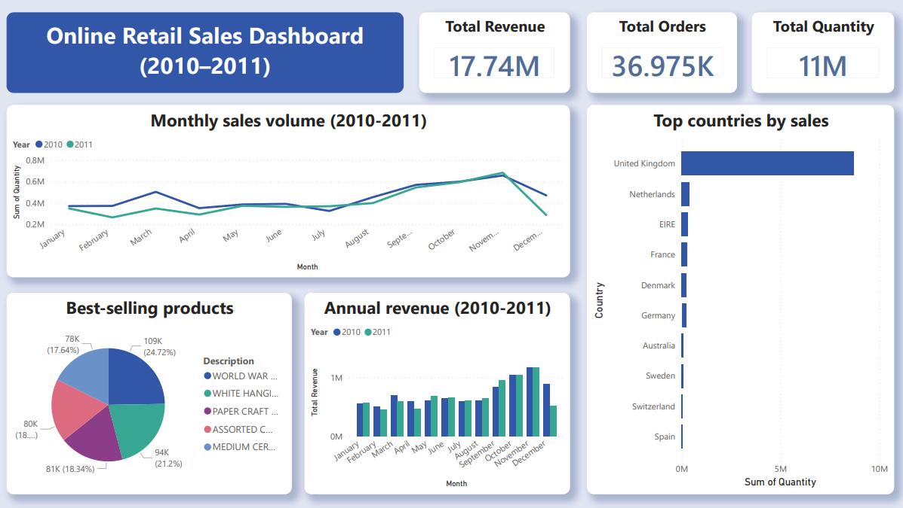

# Online Retail Analysis

## Overview
This project analyzes online retail sales (2010-2011) to explore monthly sales volume, best-selling products, annual revenue, top countries by sales, total revenue, total orders and total quantity

## Tools Used
- SQL / DB Browser - data exploration
- Power Query - data cleaning 
- Power BI - interactive dashboard

## Data Cleaning
- Removed rows where Quantity = 0
- Removed cancelled orders (Invoice starting with 'C')
- Removed rows with null Customer ID

## Questions Explored
1. What is the sales volume for each month?
2. What is the total revenue for each year?
3. Which countries have the highest sales volume?
4. Which products are the best-selling?

## Key Findings
- Sales volume peaked in November and was lowest in February
- Revenue peaked in November for both years
- United Kingdom had the highest sales volume
- WORLD WAR 2 GLIDERS ASSTD DESIGNS is the best-selling product

## Dashboard

## Data Source
https://www.kaggle.com/datasets/mashlyn/online-retail-ii-uci 

## Notes
Built with assistance from Claude (AI) for syntax guidance and layout suggestions.
